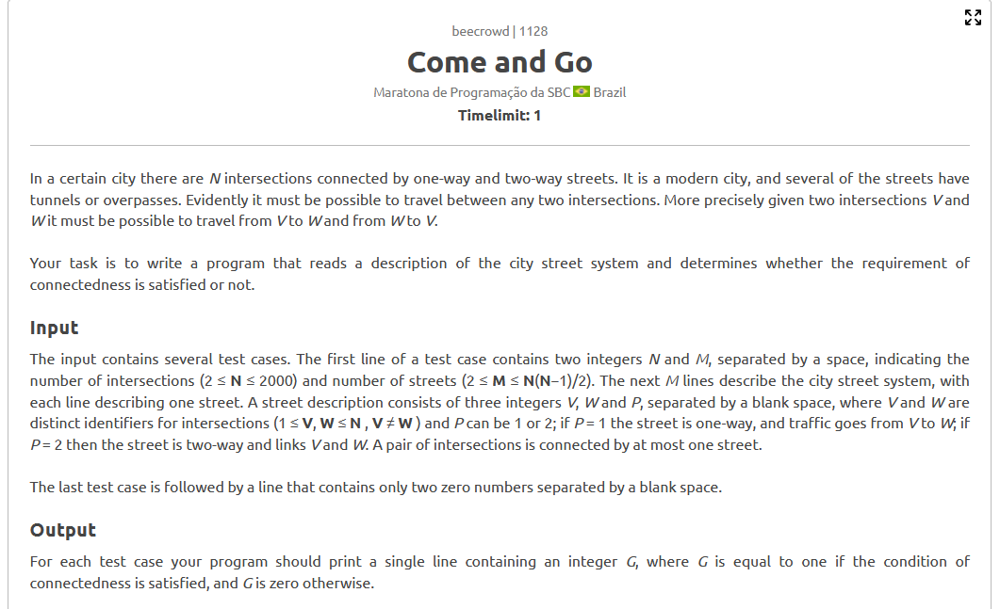
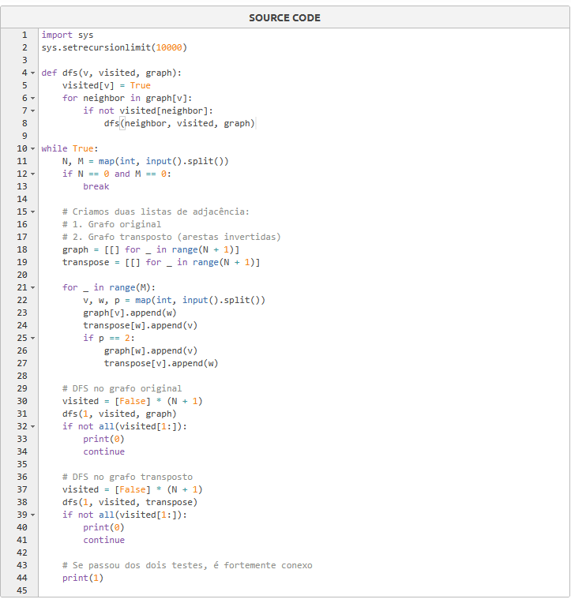

# Relatório – Problema "Come and Go" (Beecrowd 1128)

## Contextualização

A questão "Come and Go", do Beecrowd, tem como objetivo verificar se é possível ir e voltar entre quaisquer duas cidades de um mapa com ruas direcionadas (mão única ou dupla). O problema é um caso clássico de verificação de **grafo fortemente conexo**.

Ele exige:
- Leitura adequada de grafos direcionados.
- Tratamento específico para ruas de mão dupla.
- Aplicação de algoritmos de busca em profundidade (DFS) para análise de conectividade.

# Estratégia Utilizada

# Estratégia Utilizada

Para resolver o problema, aplicamos duas buscas em profundidade (DFS), com o objetivo de verificar se é possível alcançar todos os pontos a partir de um vértice inicial, e também se todos os pontos conseguem retornar a esse vértice.

O grafo foi representado com listas de adjacência, por ser leve e eficiente para percorrer os vizinhos. As duas DFS foram feitas de forma separada: uma usando o grafo conforme as conexões dadas, e outra considerando os caminhos no sentido inverso.

Se em ambas as buscas todos os vértices forem visitados, então o grafo é considerado totalmente conectado em ambos os sentidos, como exigido pelo enunciado.

# Código

[Código](1128-comeandgo.py)

## Resultado

Após os ajustes e revisão, a solução obteve sucesso nos testes do Beecrowd.  
A lógica foi validada por meio da dupla DFS e passou corretamente em **100% dos casos de teste**.

---
