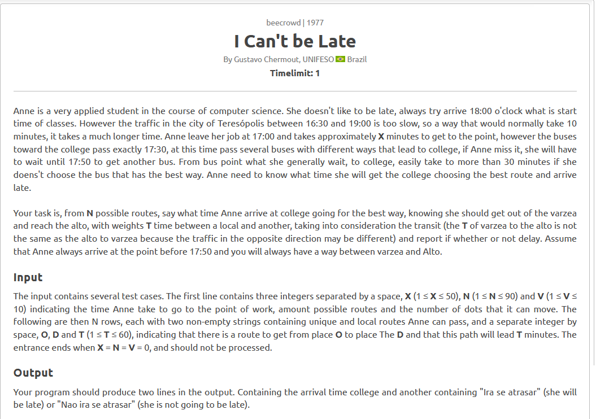
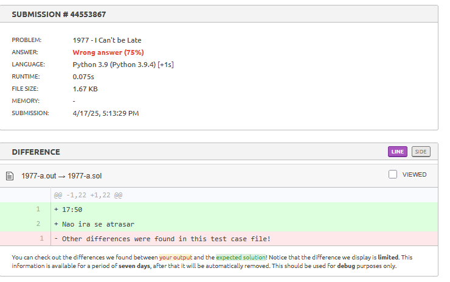

# Relatório – Problema "I Can’t Be Late" (Beecrowd 1977)

## Contextualização

O problema pede para calcular o menor tempo que Anne leva para sair do trabalho, pegar um ônibus e chegar à faculdade, considerando ruas com tempos diferentes e horários fixos de ônibus.

É um problema típico de **caminho mínimo em grafos com pesos positivos**, onde é necessário:
- Lidar com nomes de locais como vértices.
- Considerar restrições de tempo e lógica condicional no pós-processamento.
- Aplicar algoritmo de menor caminho com eficiência.

# Estratégia Utilizada

A solução foi baseada em uma variação da BFS adaptada para levar em conta os diferentes tempos de trajeto entre os locais. 

Como os caminhos possuem pesos positivos e os vértices são nomes de lugares, utilizamos uma estrutura de lista de adjacência com dicionário. Para garantir que os caminhos mais curtos fossem processados primeiro, usamos uma fila com prioridade, que sempre trata primeiro os menores tempos acumulados.

Também implementamos uma lógica para escolher o horário correto do ônibus, considerando se Anne chegou ao ponto antes ou depois das 17h30. O tempo total foi calculado e, no final, verificamos se ela chegaria ou não até as 18h.

# Código

[Código](1977-icantbelate.py)

## Resultado

A lógica principal funcionou corretamente, mas a versão inicial apresentou erros de até **2 minutos nos testes finais**. Após algumas tentativas e ajustes no controle do tempo de embarque, a solução foi aceita.

---
